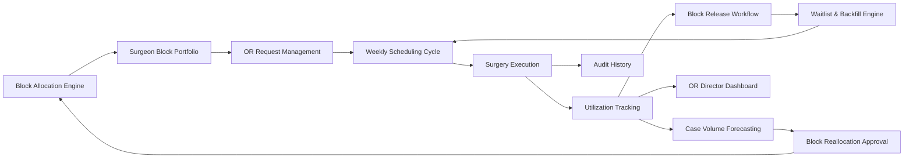
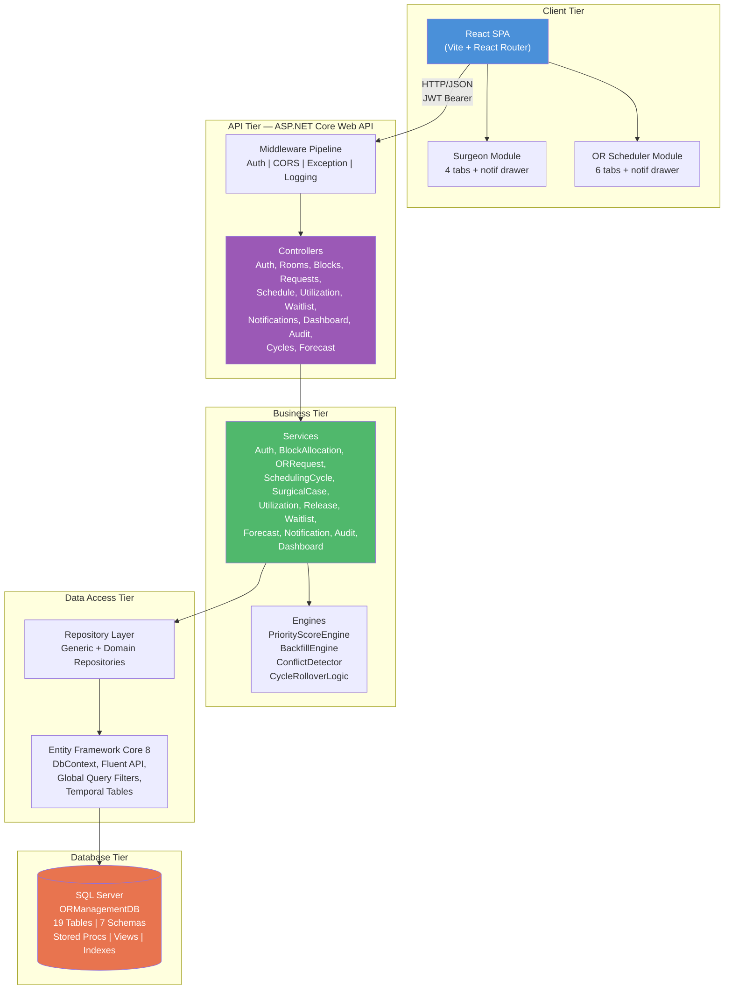

# OR Block Schedule Management System — Complete Project Plan

> **Capstone Project 16** | Database: `ORManagementDB` | Two Logins: Surgeon & OR Scheduler

---

## 1. System Summary

The OR Block Schedule Management System is a **multi-hospital capacity optimization platform** that manages the full lifecycle of operating room block allocation, utilization tracking, and release workflows.

### Core Problem
Hospitals assign fixed OR time blocks to surgeons, but surgeons often don't use all their allocated time. Meanwhile, other surgeons wait for OR access. This causes **revenue loss, surgery delays, and wasted capacity**.

### Solution
A centralized platform where:
- **Surgeons** request OR time, view their block portfolio, and release unused time
- **OR Schedulers** approve requests, manage schedules, track utilization, and backfill released slots
- **The System** auto-calculates utilization, scores waitlist priorities, enforces weekly scheduling cycles, and maintains audit trails

### Key Design Decisions
| Decision | Choice | Rationale |
|---|---|---|
| Multi-Hospital | `org.Hospitals` global table, `HospitalId` threaded everywhere | HCA-style orgs operate many facilities; cheaper to add now than retrofit |
| Scheduling Model | Weekly batch cycle (cutoff Sat EOD) | Lets scheduler optimize full week's demand vs. greedy first-come-first-served |
| Emergency Bypass | Emergencies skip the cycle entirely | Cannot wait for Friday cutoff |
| Carry-Over | Unplaced requests roll to next cycle with score boost | Fair anti-starvation; `CyclesWaited × 10` added to score |
| Starvation Flag | `CyclesWaited >= 3` → visual flag | Scheduler sees "waiting 3+ weeks" on weekly screen |

### Priority Score Formula
```
Score = PriorityWeight × 50
      + min(WaitingDays, 30) × 2
      + ReadinessWeight × 20
      + DurationFit × 15
      + CyclesWaited × 10
```

---

## 2. Module Summary (10 Core Modules)

| # | Module | Owner | Purpose |
|---|--------|-------|---------|
| 1 | **Block Allocation Engine** | OR Scheduler | Create recurring block templates, assign blocks to surgeons, define room/time ownership |
| 2 | **Surgeon Block Portfolio** | Surgeon | View assigned blocks, used/remaining hours, utilization %, release option |
| 3 | **OR Request Management** | Both | Surgeon submits requests; Scheduler reviews, approves/rejects/modifies/waitlists |
| 4 | **Utilization Tracking** | System + Scheduler | Auto-calculate `ActualUsed / Allocated × 100`, flag underutilized (<60%) blocks |
| 5 | **Block Release Workflow** | Both | Surgeon or Scheduler releases unused time → feeds into available pool |
| 6 | **Waitlist & Backfill Engine** | System + Scheduler | Score-match waiting requests to released slots; Scheduler confirms assignment |
| 7 | **Case Volume Forecasting** | System + Scheduler | Historical demand analysis, surgeon-wise/specialty-wise demand, suggested future allocation |
| 8 | **Block Reallocation Approval** | OR Scheduler | Approve/reject/modify system-recommended reallocations between surgeons |
| 9 | **OR Director Dashboard** | OR Scheduler | Business KPIs, patient care KPIs, operational KPIs, real-time OR status |

### Module Interaction Map


---

## 3. Frontend Logins & Modules

### Login 1: Surgeon (4 Tabs + Notifications Drawer)

**Surgeon Can:**
- View dashboard
- View assigned OR blocks
- View submitted requests
- Submit OR time request
- View scheduled surgeries
- Release unused block time

**Surgeon Cannot:**
- Directly assign OR room
- Directly finalize block timing
- Override other schedules
- Approve reallocation

**Tab Structure:**

| # | Tab Name | What's Inside | Key Operations |
|---|----------|--------------|----------------|
| 1 | **Surgeon Dashboard** | Summary KPI cards (assigned blocks, upcoming cases, pending requests, utilization %), upcoming surgeries table, utilization trend chart, recent notifications preview | Read-only overview |
| 2 | **Block Portfolio & Requests** | **Section A:** Assigned blocks with used/remaining hours, utilization bars, release button per block. **Section B:** Submitted requests list with status filters, cancel draft option. Combined view of block ownership + request tracking | Read, Create (release), Delete (cancel draft) |
| 3 | **Request OR Time** | Full request form: patient, date, quarter, duration, priority, procedure, equipment, readiness, remarks. Save as draft or submit | Create |
| 4 | **Scheduled Surgeries** | Confirmed surgery schedule table with date, room, time, duration, patient, status. Confirm assigned slot action | Read, Update (confirm slot) |

**Top Bar:** `[Hospital Logo] OR Block System` ... `[👤 Profile / Logout]`

> [!NOTE]
> **Notifications** will be displayed as simple **toast messages** in the UI when actions are performed (e.g., request approved, slot confirmed). They will not persist or have a dedicated drawer.

---

### Login 2: OR Scheduler (6 Tabs + Notifications Drawer)

**OR Scheduler Can:**
- Manage OR rooms
- View OR calendar
- Allocate OR blocks
- Review surgeon requests
- Approve, reject, modify, or waitlist requests
- Schedule surgeries
- Mark surgery as started / completed
- Track utilization
- Release unused time
- Backfill waitlisted requests
- Approve reallocation
- View forecasting recommendations
- View audit history

**Tab Structure:**

| # | Tab Name | What's Inside | Key Operations |
|---|----------|--------------|----------------|
| 1 | **Scheduler Dashboard** | Business KPIs (OR hours available/used, utilization %, revenue opportunity), Patient Care KPIs (pending requests, urgent waiting, avg wait days), Operational KPIs (today's schedule, room-wise utilization bars, starvation alerts), utilization trend chart, approval queue summary | Read; Drill-down to other tabs |
| 2 | **OR Rooms & Calendar** | **Section A:** Room CRUD table (create, edit, deactivate rooms). **Section B:** Visual weekly/daily OR calendar grid showing all rooms × days with allocated/available/released blocks | CRUD rooms; Read calendar; Conflict detection |
| 3 | **Block Allocation** | **Section A:** Block templates CRUD + exceptions management. **Section B:** Block allocations list with surgeon assignments, utilization status indicators. **Section C:** Request review queue with priority scores, cycle # — Approve/Reject/Modify/Waitlist actions. Weekly scheduling cycle controls (cutoff, ranked list, publish) | CRUD templates; Create/Update allocations; Approve/Reject/Modify/Waitlist requests; Publish cycle |
| 4 | **Surgery Tracking & Utilization** | **Section A:** Surgery case list — mark started, completed, cancelled; record actual times. **Section B:** Utilization reports — room-wise, surgeon-wise, day-wise bar charts and tables; underutilized block flags; release unused time action. **Section C:** Forecasting recommendations with approve/reject | Read; Update (start/complete/cancel surgery); Create (release time); Update (approve/reject forecast) |
| 5 | **Waitlist & Backfill** | **Section A:** Released slots available with scored waitlist matches per slot — assign action. **Section B:** Full waitlist table with starvation flags (CyclesWaited ≥ 3). **Section C:** Reallocation management — approve/reject/modify system recommendations | Read; Update (assign backfill, approve reallocation) |
| 6 | **Audit History** | **Tab A:** Audit logs — filterable by entity, user, action, date range with old/new values. **Tab B:** PHI access logs — every patient data view/search/export with IP address | Read-only; Filter; Export CSV |

**Top Bar:** `[Hospital Logo] OR Block System` ... `[👤 Profile / Logout]`

> [!NOTE]
> **Notifications** will be displayed as simple **toast messages** in the UI when actions are performed. They will not persist or have a dedicated drawer.

---

## 4. Phase 1: Business Understanding

### 4.1 Business Problem Statement
Operating rooms are the highest-revenue and highest-cost resources in a surgical hospital. Hospitals assign fixed OR time blocks to surgeons (e.g., Dr. Smith gets OR-1 every Monday 8 AM - 4 PM) so they can predictably schedule surgeries. 
However, inefficiencies arise when a surgeon does not use their full allocated time (e.g., they only schedule 3 hours of cases in an 8-hour block). Because they "own" the block, other surgeons who desperately need OR time cannot use the empty hours. This leads to:
- **Revenue Loss:** Empty ORs cost thousands of dollars per hour.
- **Surgery Delays:** Patients wait weeks for procedures while ORs sit empty.
- **Wasted Capacity:** Overall OR utilization drops, impacting hospital efficiency metrics.

### 4.2 Business Objectives
The OR Block Schedule Management System aims to solve this by creating a centralized marketplace and workflow for OR time:
1. **Maximize OR Utilization:** Increase overall OR utilization to ≥ 80% by actively managing released time and backfilling slots.
2. **Improve Access for Surgeons:** Provide a transparent, equitable waitlist system for surgeons to acquire extra OR time.
3. **Automate Scheduling Workflows:** Replace manual, phone/email-based block management with an automated, score-based request and allocation engine.
4. **Data-Driven Decisions:** Provide OR Directors with analytics to justify reallocating blocks from under-utilizing surgeons to high-demand surgeons.

---

## 5. Phase 2: Functional Requirements

### 5.1 Surgeon Features
- **Dashboard:** View assigned blocks, upcoming surgeries, pending requests, and personal utilization metrics.
- **Block Portfolio Management:** View assigned recurring blocks and their current usage/remaining hours.
- **Release Time:** Formally release unused block hours back to the hospital pool.
- **Request OR Time:** Submit structured requests for additional OR time specifying date, preferred quarter, duration, priority, and patient readiness.
- **Surgery Confirmation:** Confirm assigned slots for scheduled surgeries.

### 5.2 OR Scheduler Features
- **Dashboard:** Monitor hospital-wide OR KPIs (Utilization %, Available Hours, Pending Requests, Starvation Alerts).
- **Room Management:** Create, edit, and deactivate physical operating rooms.
- **Block Allocation:** Create recurring block templates, define exceptions (holidays), and generate concrete block allocations.
- **Request Queue Management:** Review surgeon requests, evaluate priority scores, and approve, reject, modify, or waitlist them.
- **Weekly Cycle Execution:** Trigger the weekly scheduling cutoff, view ranked requests, and publish the final schedule.
- **Waitlist & Backfill:** Match waitlisted requests against newly released slots using priority scoring and duration fit.
- **Surgery Tracking:** Mark scheduled cases as started/completed and record actual execution times.
- **Utilization Analytics:** Generate and export utilization reports by room, surgeon, and specialty.
- **Forecasting & Reallocation:** Review system-generated recommendations for block reallocation based on historical utilization trends.
- **Audit Trails:** View complete action logs and PHI access logs for compliance.

### 5.3 System-Automated Features
- **Priority Scoring Engine:** Automatically calculate and rank request priority based on case urgency, wait time, and cycle starvation.
- **Utilization Calculation:** Continuously compute actual vs. allocated time percentages.
- **Cycle Rollover:** Automatically boost the score of requests that fail to be scheduled in the current cycle (`CyclesWaited` tracking).
- **Matchmaking:** Automatically suggest the best waitlisted requests when a block is released.

---

## 6. Phase 3: Non-Functional Requirements

### 6.1 Performance & Scalability
- **Response Time:** 95% of API requests must complete in under 500ms. Dashboard load times must be under 2 seconds.
- **Scalability:** The system must support multi-hospital configurations seamlessly via global query filters (`HospitalId`), allowing dozens of facilities to operate independently on the same platform.
- **Concurrency:** Must handle concurrent scheduling actions without double-booking rooms. Database-level unique constraints (Room + Date + Time) are required.

### 6.2 Security & Compliance (HIPAA)
- **Authentication:** JWT-based authentication with strict role-based access control (Surgeon vs. ORScheduler).
- **Data Isolation:** Surgeons must only be able to view their own block data, patients, and requests.
- **Audit Logging:** Every mutating action (Create, Update, Delete) must be logged in an append-only `AuditLogs` table.
- **PHI Access:** Every read/search action exposing Patient Health Information (PHI) must be logged in `PhiAccessLogs` with IP and User Agent.
- **Data Encryption:** TLS 1.2+ for data in transit. 

### 6.3 Availability & Reliability
- **Uptime:** System must be highly available (99.9% uptime target) as OR scheduling is mission-critical.
- **Data Integrity:** Use Entity Framework Core transactions to ensure complex operations (e.g., approving a request, creating a surgery case, and deducting block time) succeed or fail as a single unit.

---

## 7. Phase 4: Detailed Database Design

The database (`ORManagementDB`) consists of 19 tables distributed across 7 logical schemas to support multi-tenancy, clinical workflows, and strict auditing.

### 7.1 Schema Overview

| Schema | Purpose | Tables |
|--------|---------|--------|
| `org` | Multi-hospital tenancy foundation | Hospitals |
| `auth` | User identity and RBAC | Roles, Users |
| `clinical` | Medical entities | Surgeons, Patients |
| `facility` | Physical resources | OperatingRooms |
| `scheduling` | Core block and request engine | RecurringBlockTemplates, BlockExceptions, SchedulingCycles, BlockAllocations, ORRequests, SurgicalCases, ReleasedSlots, WaitlistRequests |
| `analytics` | Historical data for reporting | UtilizationRecords, ForecastRecommendations |
| `config` | Application settings | SystemSettings |
| `audit` | Compliance tracking | AuditLogs, PhiAccessLogs |

### 7.2 Core Entities & Relationships

**`org.Hospitals`**
- Primary Key: `HospitalId`
- Fields: `Name`, `Timezone`, `IsActive`

**`auth.Users`**
- Primary Key: `UserId`
- Fields: `HospitalId` (FK), `RoleId` (FK), `Email`, `PasswordHash`, `FirstName`, `LastName`, `IsActive`

**`clinical.Surgeons`**
- Primary Key: `SurgeonId` (FK to `auth.Users`)
- Fields: `Specialty`, `LicenseNumber`

**`clinical.Patients`** (Minimal PHI)
- Primary Key: `PatientId`
- Fields: `HospitalId` (FK), `MRN`, `FirstName`, `LastName`, `DateOfBirth`

**`facility.OperatingRooms`**
- Primary Key: `RoomId`
- Fields: `HospitalId` (FK), `Name`, `Location`, `EquipmentProfile`, `IsActive`

**`scheduling.BlockAllocations`**
- Primary Key: `AllocationId`
- Fields: `HospitalId` (FK), `RoomId` (FK), `SurgeonId` (FK), `BlockDate`, `StartTime`, `EndTime`, `Status` (Allocated, Released)
- *Constraint: Unique (RoomId, BlockDate, StartTime)*

**`scheduling.ORRequests`**
- Primary Key: `RequestId`
- Fields: `HospitalId` (FK), `SurgeonId` (FK), `PatientId` (FK), `PreferredDate`, `DurationMinutes`, `PriorityLevel`, `PatientReadiness`, `Status` (Draft, Pending, Approved, Waitlisted, Rejected), `OriginalCycleId`, `CyclesWaited`

**`scheduling.SurgicalCases`**
- Primary Key: `CaseId`
- Fields: `RequestId` (FK), `AllocationId` (FK), `ScheduledStartTime`, `ScheduledEndTime`, `ActualStartTime`, `ActualEndTime`, `Status` (Scheduled, Confirmed, InProgress, Completed, Cancelled)

**`scheduling.ReleasedSlots`**
- Primary Key: `ReleaseId`
- Fields: `AllocationId` (FK), `ReleasedBySurgeonId` (FK), `ReleaseWindowStart`, `ReleaseWindowEnd`, `Reason`, `Status` (Available, Backfilled, Expired)

### 7.3 Data Integrity & Constraints
- **Multi-Tenancy:** Every table (except Roles) contains a `HospitalId`. EF Core Global Query Filters will automatically append `WHERE HospitalId = @tenantId` to all queries.
- **Temporal Tables:** System-versioned temporal tables are enabled for `Users`, `Patients`, `OperatingRooms`, `BlockAllocations`, `ORRequests`, and `SurgicalCases` to maintain a historical snapshot of all changes.
- **Soft Deletes:** Records in `OperatingRooms` and `Users` are never deleted. They are marked `IsActive = 0`.

---

## 8. Phase 5: Application Architecture

### Architecture Pattern: **Clean/Layered Architecture**

```
┌─────────────────────────────────────────────────────────────────┐
│                        CLIENT TIER                               │
│  ┌───────────────────────────────────────────────────────────┐  │
│  │                   React Frontend (SPA)                     │  │
│  │  ┌──────────┐  ┌──────────┐  ┌──────────┐  ┌──────────┐  │  │
│  │  │  Surgeon  │  │Scheduler │  │  Shared   │  │  State   │  │  │
│  │  │  Module   │  │  Module  │  │Components │  │ (Redux)  │  │  │
│  │  └──────────┘  └──────────┘  └──────────┘  └──────────┘  │  │
│  └───────────────────────────────────────────────────────────┘  │
│                          │ HTTP / JSON                            │
│                          ▼                                       │
├─────────────────────────────────────────────────────────────────┤
│                        API TIER                                  │
│  ┌───────────────────────────────────────────────────────────┐  │
│  │              ASP.NET Core Web API (.NET 8)                 │  │
│  │  ┌──────────────────────────────────────────────────────┐ │  │
│  │  │  Controllers (API Endpoints)                          │ │  │
│  │  │  • AuthController     • RoomsController               │ │  │
│  │  │  • BlocksController   • RequestsController             │ │  │
│  │  │  • ScheduleController • UtilizationController          │ │  │
│  │  │  • WaitlistController • DashboardController            │ │  │
│  │  │  • AuditController    • ForecastController             │ │  │
│  │  │  • CyclesController   • ForecastController             │ │  │
│  │  └──────────────────────────────────────────────────────┘ │  │
│  │  ┌──────────┐  ┌──────────┐  ┌──────────┐  ┌──────────┐  │  │
│  │  │   Auth   │  │  CORS    │  │Exception │  │  Logging │  │  │
│  │  │Middleware│  │Middleware│  │Middleware│  │Middleware│  │  │
│  │  └──────────┘  └──────────┘  └──────────┘  └──────────┘  │  │
│  └───────────────────────────────────────────────────────────┘  │
│                          │                                       │
│                          ▼                                       │
├─────────────────────────────────────────────────────────────────┤
│                      BUSINESS TIER                               │
│  ┌───────────────────────────────────────────────────────────┐  │
│  │              Business Layer (Services)                     │  │
│  │  ┌──────────────────────────────────────────────────────┐ │  │
│  │  │  IAuthService          IBlockAllocationService        │ │  │
│  │  │  IORRequestService     ISchedulingCycleService        │ │  │
│  │  │  ISurgicalCaseService  IUtilizationService            │ │  │
│  │  │  IReleaseService       IWaitlistService               │ │  │
│  │  │  IForecastService      IAuditService                  │ │  │
│  │  │  IDashboardService     IPriorityScoreEngine           │ │  │
│  │  │  IPriorityScoreEngine  IBackfillEngine                │ │  │
│  │  └──────────────────────────────────────────────────────┘ │  │
│  │  ┌──────────────────────────────────────────────────────┐ │  │
│  │  │  Validation Rules  │  Priority Score Calculator      │ │  │
│  │  │  Conflict Detector │  Cycle Rollover Logic           │ │  │
│  │  │  Starvation Flagger│  Duration Fit Scorer            │ │  │
│  │  └──────────────────────────────────────────────────────┘ │  │
│  └───────────────────────────────────────────────────────────┘  │
│                          │                                       │
│                          ▼                                       │
├─────────────────────────────────────────────────────────────────┤
│                    DATA ACCESS TIER                               │
│  ┌───────────────────────────────────────────────────────────┐  │
│  │            Repository Layer (Repositories)                 │  │
│  │  ┌──────────────────────────────────────────────────────┐ │  │
│  │  │  IRepository<T> (Generic)                             │ │  │
│  │  │  IHospitalRepository     IUserRepository              │ │  │
│  │  │  IBlockAllocationRepo    IORRequestRepository         │ │  │
│  │  │  ISurgicalCaseRepo       IReleasedSlotRepository      │ │  │
│  │  │  IWaitlistRepository     IUtilizationRepository       │ │  │
│  │  │  IAuditRepository                                     │ │  │
│  │  └──────────────────────────────────────────────────────┘ │  │
│  │                          │                                │  │
│  │                          ▼                                │  │
│  │  ┌──────────────────────────────────────────────────────┐ │  │
│  │  │          Entity Framework Core (EF Core 8)            │ │  │
│  │  │  • DbContext with Fluent API                          │ │  │
│  │  │  • Global Query Filters (HospitalId, IsActive)        │ │  │
│  │  │  • Temporal Table Configuration                       │ │  │
│  │  │  • Migrations                                         │ │  │
│  │  └──────────────────────────────────────────────────────┘ │  │
│  └───────────────────────────────────────────────────────────┘  │
│                          │                                       │
│                          ▼                                       │
├─────────────────────────────────────────────────────────────────┤
│                      DATABASE TIER                               │
│  ┌───────────────────────────────────────────────────────────┐  │
│  │                SQL Server (ORManagementDB)                 │  │
│  │  ┌────────┐ ┌──────────┐ ┌───────────┐ ┌──────────────┐  │  │
│  │  │  org   │ │   auth   │ │ clinical  │ │   facility   │  │  │
│  │  │1 table │ │ 2 tables │ │ 2 tables  │ │   1 table    │  │  │
│  │  └────────┘ └──────────┘ └───────────┘ └──────────────┘  │  │
│  │  ┌────────────────────┐ ┌────────────┐ ┌──────────────┐  │  │
│  │  │    scheduling      │ │ analytics  │ │    config    │  │  │
│  │  │    8 tables        │ │  2 tables  │ │   1 table    │  │  │
│  │  └────────────────────┘ └────────────┘ └──────────────┘  │  │
│  │  ┌──────────────────────────────────────────────────────┐ │  │
│  │  │  audit: 2 tables  │  Stored Procs  │  Views/Indexes │ │  │
│  │  └──────────────────────────────────────────────────────┘ │  │
│  └───────────────────────────────────────────────────────────┘  │
└─────────────────────────────────────────────────────────────────┘
```

### Architecture Diagram (Mermaid)



### Technology Stack Detail

| Layer | Technology | Version | Purpose |
|-------|-----------|---------|---------|
| Frontend | React | 18+ | SPA with component-based UI |
| State Management | Redux Toolkit | Latest | Global state for auth, notifications, cache |
| Routing | React Router | v6 | Role-based route guards |
| UI Components | Material UI / Ant Design | Latest | Professional healthcare UI |
| Charts | Recharts / Chart.js | Latest | Dashboard KPIs, utilization charts |
| Calendar | FullCalendar React | Latest | OR Calendar view |
| HTTP Client | Axios | Latest | API communication with interceptors |
| API Framework | ASP.NET Core | .NET 8 | RESTful Web API |
| Authentication | JWT Bearer Tokens | — | Stateless auth with role claims |
| ORM | Entity Framework Core | 8.x | Code-first with migrations |
| Database | SQL Server | 2022 | Temporal tables, stored procs |
| Background Jobs | Hangfire / Hosted Services | — | Cycle cutoff, auto-release, utilization calc |

### Cross-Cutting Concerns

| Concern | Implementation |
|---------|---------------|
| **Authentication** | JWT tokens with `HospitalId` and `RoleId` claims |
| **Authorization** | Role-based: `[Authorize(Roles = "Surgeon")]` / `[Authorize(Roles = "ORScheduler")]` |
| **Multi-Tenancy** | EF Core Global Query Filter on `HospitalId` from JWT claim |
| **Audit Logging** | Auto-capture via EF `SaveChanges` interceptor → `audit.AuditLogs` |
| **PHI Access Logging** | Middleware logs every access to Patient data → `audit.PhiAccessLogs` |
| **Exception Handling** | Global exception middleware → structured error responses |
| **Validation** | FluentValidation for request DTOs |
| **CORS** | Configured for React dev server origin |

---

## 9. Phase 6: API Catalog (Optimized for Dummy Data)

Since master data (Users, Hospitals, Rooms, Patients, Surgeons, Templates, Settings) will be pre-seeded as dummy data for this intern project, the API surface has been optimized to exclude their CRUD endpoints. The backend only exposes endpoints required for the core scheduling workflows.

### Authentication (Mock)
| # | Method | Endpoint | Purpose |
|---|--------|----------|---------|
| 1 | POST | `/api/auth/login` | Authenticate user, return JWT token |

### Master Data (Read-Only)
| # | Method | Endpoint | Purpose |
|---|--------|----------|---------|
| 2 | GET | `/api/users` | List users for mock switching |
| 3 | GET | `/api/rooms` | List OR rooms |
| 4 | GET | `/api/surgeons` | List surgeons |
| 5 | GET | `/api/patients` | List patients (minimal mock data) |
| 6 | GET | `/api/block-templates` | List recurring block templates |

### Block Allocations
| # | Method | Endpoint | Purpose |
|---|--------|----------|---------|
| 7 | GET | `/api/blocks` | List block allocations |
| 8 | POST | `/api/blocks/generate` | Generate blocks from templates (mock trigger) |

### Surgeon OR Requests
| # | Method | Endpoint | Purpose |
|---|--------|----------|---------|
| 9 | GET | `/api/requests` | List OR requests |
| 10 | POST | `/api/requests` | Surgeon submits new request |
| 11 | PUT | `/api/requests/{id}/approve` | Scheduler approves request |
| 12 | PUT | `/api/requests/{id}/reject` | Scheduler rejects request |
| 13 | PUT | `/api/requests/{id}/waitlist` | Scheduler moves request to waitlist |

### Scheduling Cycles
| # | Method | Endpoint | Purpose |
|---|--------|----------|---------|
| 14 | GET | `/api/cycles/current` | Get current open cycle |
| 15 | PUT | `/api/cycles/{id}/cutoff` | Trigger cycle cutoff manually |
| 16 | GET | `/api/cycles/{id}/ranked-requests` | Get all cycle requests ranked by priority score |
| 17 | PUT | `/api/cycles/{id}/publish` | Publish cycle |

### Surgical Cases
| # | Method | Endpoint | Purpose |
|---|--------|----------|---------|
| 18 | GET | `/api/cases` | List scheduled surgical cases |
| 19 | PUT | `/api/cases/{id}/start` | Mark surgery as started |
| 20 | PUT | `/api/cases/{id}/complete` | Mark surgery as completed |
| 21 | PUT | `/api/cases/{id}/confirm` | Surgeon confirms slot |

### Block Release & Waitlist
| # | Method | Endpoint | Purpose |
|---|--------|----------|---------|
| 22 | POST | `/api/released-slots` | Release unused block time |
| 23 | GET | `/api/waitlist` | List all waitlisted requests |
| 24 | GET | `/api/released-slots/{id}/matches` | Get scored waitlist matches for a slot |
| 25 | PUT | `/api/waitlist/{id}/assign` | Assign waitlisted request to a released slot |

### Dashboards & Utilization
| # | Method | Endpoint | Purpose |
|---|--------|----------|---------|
| 26 | GET | `/api/utilization/summary` | Get aggregated utilization summary (KPIs) |
| 27 | GET | `/api/dashboard/scheduler` | Get OR Scheduler dashboard data |
| 28 | GET | `/api/dashboard/surgeon` | Get Surgeon dashboard data |

**Total: 28 Core API Endpoints.**

---

## 10. Phase 7: User Interface Planning

### Screen Inventory

#### Shared Screens
| # | Screen | Type | Description |
|---|--------|------|-------------|
| S1 | Login Page | Auth | Email/password login with hospital selector dropdown |


#### Surgeon Screens (4 tabs)

##### S2: Tab 1 — Surgeon Dashboard
```
┌─────────────────────────────────────────────────────────────────────┐
│  [🏥 Logo]  OR Block System    [Dashboard] [Portfolio] [Request] [Surgeries]            [👤▼]│
├─────────────────────────────────────────────────────────────────────┤
│  Welcome back, Dr. Kumar                                             │
│                                                                      │
│  ┌──────────────┐ ┌──────────────┐ ┌──────────────┐ ┌─────────────┐ │
│  │  📦 Assigned  │ │  📅 Upcoming │ │  📋 Requests │ │ 📊 My Util  │ │
│  │   Blocks      │ │   Cases      │ │              │ │             │ │
│  │     3         │ │     5        │ │  Pending: 2  │ │   72.5%     │ │
│  │               │ │              │ │  Approved: 1 │ │   ▓▓▓▓▓░░░  │ │
│  └──────────────┘ └──────────────┘ └──────────────┘ └─────────────┘ │
│                                                                      │
│  ┌──────────────────────────────────────────────────────────────┐    │
│  │  Upcoming Surgeries This Week                                │    │
│  │  ┌───────┬──────────┬───────┬──────────┬────────┬──────────┐ │    │
│  │  │ Date  │ Time     │ Room  │ Patient  │ Dur    │ Status   │ │    │
│  │  ├───────┼──────────┼───────┼──────────┼────────┼──────────┤ │    │
│  │  │ Mon   │ 8:00 AM  │ OR-2  │ P-1001   │ 3h     │Confirmed │ │    │
│  │  │ Wed   │ 10:00 AM │ OR-1  │ P-1042   │ 2h     │Scheduled │ │    │
│  │  │ Fri   │ 1:00 PM  │ OR-2  │ P-1088   │ 1.5h   │Confirmed │ │    │
│  │  └───────┴──────────┴───────┴──────────┴────────┴──────────┘ │    │
│  └──────────────────────────────────────────────────────────────┘    │
│                                                                      │
│  ┌──────────────────────────────────────────────────────────────┐    │
│  │  My Utilization Trend (4 wks)                                │    │
│  │                                                              │    │
│  │  Wk1  ▓▓▓▓▓▓▓░░  78%                                         │    │
│  │  Wk2  ▓▓▓▓▓▓░░░  68%                                         │    │
│  │  Wk3  ▓▓▓▓▓▓▓▓░  82%                                         │    │
│  │  Wk4  ▓▓▓▓▓░░░░  62%                                         │    │
│  └──────────────────────────────────────────────────────────────┘    │
└─────────────────────────────────────────────────────────────────────┘
```

##### S3: Tab 2 — Block Portfolio & Requests (Combined View)
This tab merges **Block Portfolio**, **My Requests**, and **Release Time** into one screen with two sections.

```
┌─────────────────────────────────────────────────────────────────────┐
│  Block Portfolio & Requests                    [Week ◄ ►] [Filter ▼]│
├─────────────────────────────────────────────────────────────────────┤
│                                                                      │
│  ── SECTION A: My Block Portfolio ─────────────────────────────────  │
│                                                                      │
│  ┌───────────────────────────────────────────────────────────────┐  │
│  │ Block: OR-2 | Monday 8:00 AM - 4:00 PM | 8 hrs               │  │
│  │ ┌──────────┐ ┌──────────┐ ┌──────────┐ ┌──────────┐          │  │
│  │ │ Used     │ │ Scheduled│ │ Remaining│ │ Util %   │          │  │
│  │ │ 5 hrs    │ │ 2 cases  │ │ 3 hrs    │ │ 62.5%    │          │  │
│  │ └──────────┘ └──────────┘ └──────────┘ └──────────┘          │  │
│  │ ▓▓▓▓▓▓▓▓▓▓▓▓▓▓░░░░░░░░░░  ◄ utilization bar                │  │
│  │ Cases: Knee Replacement (3h) | ACL Repair (2h)               │  │
│  │                                                  [🔓 Release] │  │
│  └───────────────────────────────────────────────────────────────┘  │
│  ┌───────────────────────────────────────────────────────────────┐  │
│  │ Block: OR-3 | Wednesday 10:00 AM - 2:00 PM | 4 hrs           │  │
│  │ ┌──────────┐ ┌──────────┐ ┌──────────┐ ┌──────────┐          │  │
│  │ │ Used     │ │ Scheduled│ │ Remaining│ │ Util %   │          │  │
│  │ │ 4 hrs    │ │ 1 case   │ │ 0 hrs    │ │ 100%     │          │  │
│  │ └──────────┘ └──────────┘ └──────────┘ └──────────┘          │  │
│  │ ▓▓▓▓▓▓▓▓▓▓▓▓▓▓▓▓▓▓▓▓▓▓▓  ◄ utilization bar                │  │
│  └───────────────────────────────────────────────────────────────┘  │
│                                                                      │
│  ── Release Time Modal (triggered by 🔓 button) ──────────────────  │
│  │ Block:          OR-2, Monday 8AM-4PM                          │  │
│  │ Total Hours:     8.0                                          │  │
│  │ Scheduled:       5.0 hours                                    │  │
│  │ Available:       3.0 hours                                    │  │
│  │ Release Window:  [1:00 PM] to [4:00 PM]                       │  │
│  │ Reason:          [No additional cases this week          ]    │  │
│  │ ⚠️ Released time will be added to the available pool.          │  │
│  │                              [Cancel]  [Release Time]          │  │
│  └───────────────────────────────────────────────────────────────  │
│                                                                      │
│  ── SECTION B: My Requests ────────────────────────────────────────  │
│                                                                      │
│  Status: [All ▼]  Date: [From 📅] [To 📅]  [🔍 Search]             │
│                                                                      │
│  ┌────┬──────────┬────────┬────────┬──────────┬──────┬───────────┐  │
│  │ ID │ Date     │Duration│Priority│ Status   │Cycle#│ Actions   │  │
│  ├────┼──────────┼────────┼────────┼──────────┼──────┼───────────┤  │
│  │ 42 │ Jan 15   │ 3h     │ Urgent │ Approved │  5   │ [View]    │  │
│  │ 43 │ Jan 17   │ 2h     │Elective│ Pending  │  5   │ [View][✗] │  │
│  │ 44 │ Jan 20   │ 4h     │Elective│Waitlisted│  4   │ [View]    │  │
│  │ 45 │ Jan 22   │ 1.5h   │ Urgent │ Rejected │  5   │ [View]    │  │
│  └────┴──────────┴────────┴────────┴──────────┴──────┴───────────┘  │
│  Showing 1-4 of 4                          [◄ Prev] [1] [Next ►]    │
└─────────────────────────────────────────────────────────────────────┘
```

##### S4: Tab 3 — Request OR Time (Create Form)
```
┌─────────────────────────────────────────────────────────────────────┐
│  Request OR Time                                                     │
├─────────────────────────────────────────────────────────────────────┤
│                                                                      │
│  ┌───────────────────────────────────────────────────────────────┐  │
│  │  Patient *            [Search / Select Patient ▼           ]  │  │
│  │                                                               │  │
│  │  Preferred Date *     [📅 Date Picker                     ]  │  │
│  │                                                               │  │
│  │  Preferred Quarter *  ◉ Q1 (7 AM – 11 AM)                    │  │
│  │                       ◉ Q2 (11 AM – 3 PM)                    │  │
│  │                       ◉ Q3 (3 PM – 7 PM)                     │  │
│  │                       ◉ Q4 (7 PM – 11 PM)                    │  │
│  │                                                               │  │
│  │  Est. Duration *      [  2.5  ] hours                         │  │
│  │                                                               │  │
│  │  Case Type *          [Elective             ▼]                │  │
│  │                                                               │  │
│  │  Priority *           ◉ Elective   ◉ Urgent   ◉ Emergency    │  │
│  │                                                               │  │
│  │  Procedure Name *     [__________________________________ ]   │  │
│  │                                                               │  │
│  │  Equipment Needed     [__________________________________ ]   │  │
│  │                                                               │  │
│  │  Patient Readiness *  ◉ Ready   ◉ PendingClearance   ◉ NotReady│ │
│  │                                                               │  │
│  │  Remarks              [__________________________________ ]   │  │
│  │                       [__________________________________ ]   │  │
│  │                                                               │  │
│  │                [Save as Draft]       [Submit Request]          │  │
│  └───────────────────────────────────────────────────────────────┘  │
│                                                                      │
│  ⚠️ Emergency requests bypass the weekly cycle and are routed       │
│  directly to the OR Scheduler for immediate scheduling.              │
└─────────────────────────────────────────────────────────────────────┘
```

##### S5: Tab 4 — Scheduled Surgeries
```
┌─────────────────────────────────────────────────────────────────────┐
│  Scheduled Surgeries                             [This Week ▼]      │
├─────────────────────────────────────────────────────────────────────┤
│                                                                      │
│  ┌────┬──────────┬──────┬──────────┬──────┬──────────┬────────┬────┐│
│  │ #  │ Date     │ Room │ Time     │ Dur  │ Patient  │ Status │Act ││
│  ├────┼──────────┼──────┼──────────┼──────┼──────────┼────────┼────┤│
│  │ 1  │ Mon 1/13 │ OR-2 │ 8:00 AM  │ 3h   │ P-1001   │Scheduled│[✓] ││
│  │ 2  │ Wed 1/15 │ OR-1 │ 10:00 AM │ 2h   │ P-1042   │Confirmed│ —  ││
│  │ 3  │ Fri 1/17 │ OR-2 │ 1:00 PM  │ 1.5h │ P-1088   │Confirmed│ —  ││
│  └────┴──────────┴──────┴──────────┴──────┴──────────┴────────┴────┘│
│                                                                      │
│  [✓] = Confirm assigned slot                                        │
│                                                                      │
│  ── Case Detail (click row to expand) ────────────────────────────  │
│  │ Case #1: Knee Replacement                                     │  │
│  │ Surgeon: Dr. Kumar | Patient: John Doe (P-1001)               │  │
│  │ Block: OR-2 Monday 8AM-4PM | Assigned Time: 8:00 AM - 11:00 AM│ │
│  │ Priority: Elective | Equipment: Standard                      │  │
│  │ Status: Scheduled → [Confirm Slot]                             │  │
│  └───────────────────────────────────────────────────────────────  │
└─────────────────────────────────────────────────────────────────────┘
```

---

#### OR Scheduler Screens (6 tabs)

##### S6: Tab 1 — Scheduler Dashboard
```
┌───────────────────────────────────────────────────────────────────────────┐
│ [🏥]  OR Block System  [Dashboard] [Rooms] [Allocation] [Surgery] [Waitlist] [Audit]         [👤▼]│
├───────────────────────────────────────────────────────────────────────────┤
│  Hospital: [City General ▼]                                               │
│                                                                           │
│  ── Business KPIs ─────────────────────────────────────────────────────── │
│  ┌──────────────┐ ┌──────────────┐ ┌──────────────┐ ┌────────────────┐   │
│  │ OR Hours     │ │ OR Hours     │ │ Utilization  │ │ Est. Revenue   │   │
│  │ Available    │ │ Used         │ │ Percentage   │ │ Opportunity    │   │
│  │   120 hrs    │ │   89 hrs     │ │    74.2%     │ │   $186,000     │   │
│  └──────────────┘ └──────────────┘ └──────────────┘ └────────────────┘   │
│                                                                           │
│  ── Patient Care KPIs ─────────────────────────────────────────────────── │
│  ┌──────────────┐ ┌──────────────┐ ┌──────────────┐ ┌────────────────┐   │
│  │ Pending      │ │ Urgent       │ │ Avg Waiting  │ │ Backfilled     │   │
│  │ Requests     │ │ Waiting      │ │ Days         │ │ This Week      │   │
│  │     12       │ │      3       │ │    4.2       │ │      5         │   │
│  └──────────────┘ └──────────────┘ └──────────────┘ └────────────────┘   │
│                                                                           │
│  ┌──────────────────────────────┐  ┌──────────────────────────────────┐  │
│  │  Utilization by Room         │  │  Today's OR Schedule              │  │
│  │  OR-1  ▓▓▓▓▓▓▓▓▓▓▓▓▓▓▓░░  82%│  │  OR-1: ▓▓▓▓░░░░ (3 cases)      │  │
│  │  OR-2  ▓▓▓▓▓▓▓▓▓▓▓░░░░░░  68%│  │  OR-2: ▓▓▓▓▓▓░░ (2 cases)      │  │
│  │  OR-3  ▓▓▓▓▓▓░░░░░░░░░░░  45%│  │  OR-3: ▓▓░░░░░░ (1 case)       │  │
│  │  OR-4  ▓▓▓▓▓▓▓▓▓▓▓▓▓▓▓▓▓  95%│  │  OR-4: ░░░░░░░░ (0 cases)      │  │
│  └──────────────────────────────┘  └──────────────────────────────────┘  │
│                                                                           │
│  ┌──────────────────────────────┐  ┌──────────────────────────────────┐  │
│  │  Utilization Trend (4 weeks) │  │  ⚠️ Starvation Alerts            │  │
│  │  [======= Line Chart =======]│  │  Req #31 — Dr. Rao — 4 cycles   │  │
│  │  Wk1: 72% | Wk2: 76%        │  │  Req #28 — Dr. Kim — 3 cycles   │  │
│  │  Wk3: 74% | Wk4: 74%        │  │                                  │  │
│  │                              │  │  [View Waitlist →]               │  │
│  └──────────────────────────────┘  └──────────────────────────────────┘  │
│                                                                           │
│  ┌────────────────────────────────────────────────────────────────────┐  │
│  │  Approval Queue Preview (top 5 by score)                           │  │
│  │  #50 Dr.Mehta (142) | #31 Dr.Rao (125⚠️) | #48 Dr.Kumar (108)     │  │
│  │  [Open Block Allocation →]                                         │  │
│  └────────────────────────────────────────────────────────────────────┘  │
└───────────────────────────────────────────────────────────────────────────┘
```

##### S7: Tab 2 — OR Rooms & Calendar (Combined View)
This tab merges **Room CRUD** and **OR Calendar** into one screen with two sections.

```
┌───────────────────────────────────────────────────────────────────────────┐
│  OR Rooms & Calendar                                                      │
├───────────────────────────────────────────────────────────────────────────┤
│                                                                           │
│  ── SECTION A: OR Rooms ──────────────────────────────  [+ Add New Room]  │
│                                                                           │
│  ┌────┬──────────┬──────────┬─────────────┬────────┬───────────────────┐  │
│  │ ID │ Room Name│ Location │ Equipment   │ Status │ Actions           │  │
│  ├────┼──────────┼──────────┼─────────────┼────────┼───────────────────┤  │
│  │  1 │ OR-1     │ Floor 2  │ Standard    │ Active │ [✏️ Edit] [🗑️ Off]│  │
│  │  2 │ OR-2     │ Floor 2  │ Cardiac     │ Active │ [✏️ Edit] [🗑️ Off]│  │
│  │  3 │ OR-3     │ Floor 3  │ Neuro       │ Active │ [✏️ Edit] [🗑️ Off]│  │
│  │  4 │ OR-4     │ Floor 3  │ Standard    │Inactive│ [✏️ Edit] [🔄 On] │  │
│  └────┴──────────┴──────────┴─────────────┴────────┴───────────────────┘  │
│                                                                           │
│  ── Add/Edit Room Modal ─────────────────────────────────────────────    │
│  │ Room Name *      [OR-5                    ]                       │   │
│  │ Location *       [Floor 4                 ]                       │   │
│  │ Equipment Type   [Standard            ▼   ]                       │   │
│  │ Notes            [________________________]                       │   │
│  │                          [Cancel]  [Save Room]                    │   │
│  └───────────────────────────────────────────────────────────────────    │
│                                                                           │
│  ── SECTION B: OR Calendar ─────────────── [◄ Week ►] [Day|Week] [Filter]│
│                                                                           │
│  ┌───────┬───────────┬───────────┬───────────┬───────────┬──────────┐    │
│  │       │ Monday    │ Tuesday   │ Wednesday │ Thursday  │ Friday   │    │
│  ├───────┼───────────┼───────────┼───────────┼───────────┼──────────┤    │
│  │ OR-1  │▓▓Dr.Kumar │░░░░░░░░░░│▓▓Dr.Patel │░░░░░░░░░░│▓▓Dr.Rao  │    │
│  │       │▓▓ 8AM-4PM │           │▓▓10AM-2PM │           │▓▓ 8AM-12 │    │
│  ├───────┼───────────┼───────────┼───────────┼───────────┼──────────┤    │
│  │ OR-2  │▓▓Dr.Rao   │▓▓Dr.Mehta │░░░░░░░░░░│▓▓Dr.Rao   │░░░░░░░░ │    │
│  │       │▓▓ 8AM-4PM │▓▓ 8AM-12  │           │▓▓ 8AM-4PM │          │    │
│  ├───────┼───────────┼───────────┼───────────┼───────────┼──────────┤    │
│  │ OR-3  │░░░░░░░░░░│░░░░░░░░░░│▓▓Dr.Singh │▓▓Dr.Patel │░░░░░░░░ │    │
│  │       │           │           │▓▓ 1PM-5PM │▓▓ 8AM-12  │          │    │
│  └───────┴───────────┴───────────┴───────────┴───────────┴──────────┘    │
│                                                                           │
│  Legend: ▓▓ Allocated  ░░ Available  🟡 Released  🔴 Conflict            │
└───────────────────────────────────────────────────────────────────────────┘
```

##### S8: Tab 3 — Block Allocation (Templates + Allocations + Request Review + Cycle)
This is the most complex tab. It combines block templates, allocations, request review queue, and weekly scheduling cycle into one screen with **sub-tabs or accordion sections**.

```
┌───────────────────────────────────────────────────────────────────────────┐
│  Block Allocation         [Sub-Tab: Templates] [Allocations] [Requests] [Cycle]│
├───────────────────────────────────────────────────────────────────────────┤
│                                                                           │
│  ═══ Sub-Tab: Templates ══════════════════════════ [+ Create Template]    │
│                                                                           │
│  ┌────┬──────┬──────────┬──────────┬───────────┬───────┬──────────────┐   │
│  │ ID │ Room │ Day      │ Time     │ Surgeon   │ Active│ Actions      │   │
│  ├────┼──────┼──────────┼──────────┼───────────┼───────┼──────────────┤   │
│  │  1 │ OR-1 │ Monday   │ 8AM-4PM  │ Dr. Kumar │  ✅   │ [✏️][🗑️][📋] │   │
│  │  2 │ OR-2 │ Monday   │ 8AM-4PM  │ Dr. Rao   │  ✅   │ [✏️][🗑️][📋] │   │
│  │  3 │ OR-1 │ Wednesday│ 10AM-2PM │ Dr. Patel │  ✅   │ [✏️][🗑️][📋] │   │
│  └────┴──────┴──────────┴──────────┴───────────┴───────┴──────────────┘   │
│  📋 = Manage exceptions   [Generate Blocks for Date Range]               │
│                                                                           │
│  Exceptions for Template #1:                                              │
│  • Jan 20 (MLK Day) — Skip    [✗ Remove]                                 │
│  • Feb 17 (Presidents Day)    [✗ Remove]                                 │
│  [+ Add Exception Date]                                                   │
│                                                                           │
│  ═══ Sub-Tab: Allocations ══════════ [Week: Jan 13-17 ◄ ►] [Filter ▼]   │
│                                                                           │
│  ┌────┬──────┬──────────┬──────────┬───────────┬──────┬────┬──────────┐   │
│  │ ID │ Room │ Date     │ Time     │ Surgeon   │Util% │ St │ Actions  │   │
│  ├────┼──────┼──────────┼──────────┼───────────┼──────┼────┼──────────┤   │
│  │ 10 │ OR-1 │ Mon 1/13 │ 8AM-4PM  │ Dr. Kumar │ 62%  │ 🟡 │ [✏️][🔓] │   │
│  │ 11 │ OR-2 │ Mon 1/13 │ 8AM-4PM  │ Dr. Rao   │ 95%  │ 🟢 │ [✏️]     │   │
│  │ 12 │ OR-1 │ Wed 1/15 │ 10AM-2PM │ Dr. Patel │ 0%   │ 🔴 │ [✏️][🔓] │   │
│  └────┴──────┴──────────┴──────────┴───────────┴──────┴────┴──────────┘   │
│  Legend: 🟢 ≥80%  🟡 60-79%  🔴 <60%  |  🔓 = Release unused time      │
│  [+ Manual Allocation]                                                    │
│                                                                           │
│  ═══ Sub-Tab: Requests ══════ [Cycle: Week Jan 20-24 ▼] [Status Filter]  │
│                                                                           │
│  Pending: 12  |  This Cycle: 18  |  Starvation ⚠️: 2                     │
│                                                                           │
│  ┌────┬─────────┬──────┬──────┬──────┬───────┬──────┬────────────────┐   │
│  │ ID │ Surgeon │ Date │ Dur  │Prior │ Score │ Cyc# │ Actions        │   │
│  ├────┼─────────┼──────┼──────┼──────┼───────┼──────┼────────────────┤   │
│  │ 50 │Dr.Mehta │ 1/21 │ 2.5h │Urgent│  142  │   0  │ [Review ►]     │   │
│  │ 48 │Dr.Kumar │ 1/22 │ 3h   │Elect.│  108  │   2  │ [Review ►]     │   │
│  │ 31 │Dr.Rao   │ 1/20 │ 4h   │Elect.│  125  │ ⚠️ 4 │ [Review ►]     │   │
│  └────┴─────────┴──────┴──────┴──────┴───────┴──────┴────────────────┘   │
│                                                                           │
│  ── Review Detail Panel (expand on [Review ►]) ──────────────────────    │
│  │ Request #50: Dr. Mehta | Urgent | 2.5h | Jan 21                   │   │
│  │ Patient: P-2045 | Readiness: Ready | Equipment: Standard          │   │
│  │ Procedure: Appendectomy                                           │   │
│  │ Score: Priority(100) + Wait(12) + Ready(20) + Fit(10) + Cyc(0)=142│   │
│  │                                                                   │   │
│  │ [✅ Approve]  [❌ Reject]  [✏️ Modify]  [⏳ Waitlist]              │   │
│  └───────────────────────────────────────────────────────────────────    │
│                                                                           │
│  ═══ Sub-Tab: Weekly Cycle ═══════ [Cycle: Jan 20-24] [Status: Open]     │
│                                                                           │
│  Cycle: Open → [Trigger Cutoff] → Scheduling → [Publish]                 │
│                                                                           │
│  Ranked Requests (23 total, sorted by priority score):                    │
│  ┌───┬─────────┬───────┬──────┬────────┬──────────────────────────────┐   │
│  │ # │ Surgeon │ Score │ Dur  │ Status │ Assign To                    │   │
│  ├───┼─────────┼───────┼──────┼────────┼──────────────────────────────┤   │
│  │ 1 │Dr.Mehta │  142  │ 2.5h │ Pending│ [OR-1 Mon 8AM        ▼] [✓] │   │
│  │ 2 │Dr.Rao   │  125⚠️│ 4h   │ Carry  │ [OR-2 Tue 8AM        ▼] [✓] │   │
│  │ 3 │Dr.Kumar │  108  │ 3h   │ Pending│ [OR-1 Wed 10AM       ▼] [✓] │   │
│  │...│         │       │      │        │                              │   │
│  │22 │Dr.Singh │   42  │ 2h   │ Pending│ [No slot available    ] [WL] │   │
│  │23 │Dr.Jain  │   38  │ 5h   │ Pending│ [No slot available    ] [WL] │   │
│  └───┴─────────┴───────┴──────┴────────┴──────────────────────────────┘   │
│                                                                           │
│  Capacity: 96 hrs available | 78 hrs assigned | 18 hrs open              │
│  [Save Assignments]  [Publish Cycle]                                      │
└───────────────────────────────────────────────────────────────────────────┘
```

##### S9: Tab 4 — Surgery Tracking & Utilization (Combined View)
This tab merges **Surgery Case Management** and **Utilization Reports** with **Forecasting**.

```
┌───────────────────────────────────────────────────────────────────────────┐
│  Surgery Tracking & Utilization     [Sub-Tab: Cases] [Utilization] [Forecast]│
├───────────────────────────────────────────────────────────────────────────┤
│                                                                           │
│  ═══ Sub-Tab: Surgery Cases ════════════════════════ [This Week ▼] [🔍]  │
│                                                                           │
│  ┌────┬──────────┬──────┬──────────┬──────┬──────────┬──────────┬────────┐│
│  │ ID │ Date     │ Room │ Surgeon  │ Dur  │ Patient  │ Status   │Actions ││
│  ├────┼──────────┼──────┼──────────┼──────┼──────────┼──────────┼────────┤│
│  │201 │ Mon 1/13 │ OR-1 │ Dr.Kumar │ 3h   │ P-1001   │Scheduled │[▶ Start]│
│  │202 │ Mon 1/13 │ OR-2 │ Dr.Rao   │ 4h   │ P-1023   │In Progress│[✓ Done]│
│  │203 │ Wed 1/15 │ OR-1 │ Dr.Patel │ 2h   │ P-1042   │Confirmed │  —     ││
│  │204 │ Wed 1/15 │ OR-3 │ Dr.Singh │ 2.5h │ P-1055   │Completed │  —     ││
│  │205 │ Thu 1/16 │ OR-2 │ Dr.Rao   │ 3h   │ P-1067   │Cancelled │  —     ││
│  └────┴──────────┴──────┴──────────┴──────┴──────────┴──────────┴────────┘│
│                                                                           │
│  ── Start Surgery Modal ──────────────────────────────────────────────   │
│  │ Case #201: Dr. Kumar | OR-1 | Knee Replacement                    │  │
│  │ Actual Start Time *  [  8:15 AM  ]                                 │  │
│  │                              [Cancel]  [Mark as Started]           │  │
│  └───────────────────────────────────────────────────────────────────    │
│                                                                           │
│  ── Complete Surgery Modal ───────────────────────────────────────────   │
│  │ Case #202: Dr. Rao | OR-2 | Hip Replacement                       │  │
│  │ Actual End Time *    [ 11:45 AM  ]                                 │  │
│  │ Complications?       [None ▼]                                      │  │
│  │ Notes                [________________________________]            │  │
│  │                              [Cancel]  [Mark as Completed]         │  │
│  └───────────────────────────────────────────────────────────────────    │
│                                                                           │
│  ═══ Sub-Tab: Utilization ══════════════ [Date Range] [Export 📊]        │
│                                                                           │
│  View By: [◉ Room] [◉ Surgeon] [◉ Day] [◉ Specialty]                    │
│                                                                           │
│  ┌─────────────────────────────────────────────────────────────────────┐ │
│  │  Room-Wise Utilization                                              │ │
│  │  OR-1  ▓▓▓▓▓▓▓▓▓▓▓▓▓▓▓▓░░░░  82%                                  │ │
│  │  OR-2  ▓▓▓▓▓▓▓▓▓▓▓▓▓░░░░░░░  68%                                  │ │
│  │  OR-3  ▓▓▓▓▓▓▓▓░░░░░░░░░░░░  45% ⚠️ Underutilized                  │ │
│  │  OR-4  ▓▓▓▓▓▓▓▓▓▓▓▓▓▓▓▓▓▓▓  95%                                  │ │
│  └─────────────────────────────────────────────────────────────────────┘ │
│                                                                           │
│  ┌─────────────────────────────────────────────────────────────────────┐ │
│  │  Surgeon Utilization Detail                                         │ │
│  │  ┌───────────┬──────────┬─────────┬───────┬───────────────────┐    │ │
│  │  │ Surgeon   │ Allocated│ Used    │ Util% │ Status            │    │ │
│  │  ├───────────┼──────────┼─────────┼───────┼───────────────────┤    │ │
│  │  │ Dr.Kumar  │  32 hrs  │  20 hrs │ 62.5% │ 🟡 Moderate       │    │ │
│  │  │ Dr.Rao    │  24 hrs  │  23 hrs │ 95.8% │ 🟢 Good           │    │ │
│  │  │ Dr.Patel  │  16 hrs  │   6 hrs │ 37.5% │ 🔴 Underutilized  │    │ │
│  │  └───────────┴──────────┴─────────┴───────┴───────────────────┘    │ │
│  └─────────────────────────────────────────────────────────────────────┘ │
│                                                                           │
│  Underutilized Blocks (< 60%):                                            │
│  • OR-3 Wed — Dr. Patel — 37.5% — [🔓 Release Time]                     │
│  • OR-1 Mon — Dr. Kumar — 62.5% (borderline)                             │
│                                                                           │
│  ═══ Sub-Tab: Forecasting ══════════════════════════════════════════════  │
│                                                                           │
│  ┌─────────────────────────────────────────────────────────────────────┐ │
│  │  Recommendations                                                    │ │
│  │  ┌────┬─────────────────────────────────────┬───────┬─────────────┐│ │
│  │  │ ID │ Recommendation                      │ Type  │ Actions     ││ │
│  │  ├────┼─────────────────────────────────────┼───────┼─────────────┤│ │
│  │  │ R1 │ Reduce Dr. Patel block by 2 hrs/wk  │ Reduce│ [✅][❌]    ││ │
│  │  │ R2 │ Increase Dr. Rao block by 4 hrs/wk  │ Expand│ [✅][❌]    ││ │
│  │  │ R3 │ High demand Tuesdays — add OR slot   │ Add   │ [✅][❌]    ││ │
│  │  └────┴─────────────────────────────────────┴───────┴─────────────┘│ │
│  │                                                                    │ │
│  │  Demand Analysis:                                                  │ │
│  │  Dr. Rao: Requested 40 hrs → Received 25 hrs (deficit)             │ │
│  │  Dr. Kumar: Received 40 hrs → Used 18 hrs (surplus)                │ │
│  └─────────────────────────────────────────────────────────────────────┘ │
└───────────────────────────────────────────────────────────────────────────┘
```

##### S10: Tab 5 — Waitlist & Backfill
```
┌───────────────────────────────────────────────────────────────────────────┐
│  Waitlist & Backfill                                  [Refresh Matches]   │
├───────────────────────────────────────────────────────────────────────────┤
│                                                                           │
│  ── Released Slots Available: 3 ───────────────────────────────────────── │
│                                                                           │
│  ┌──────────────────────────────────────────────────────────────────────┐│
│  │ Slot: OR-1 | Wed Jan 15 | 2:00 PM - 4:00 PM | 2 hrs                 ││
│  │ Released by: Dr. Kumar | Reason: No additional cases                 ││
│  │                                                                      ││
│  │ Best Matches (scored):                                               ││
│  │ ┌───┬─────────┬───────┬──────┬──────┬─────────────────────────────┐  ││
│  │ │ # │ Surgeon │ Score │ Dur  │Prior │ Action                      │  ││
│  │ ├───┼─────────┼───────┼──────┼──────┼─────────────────────────────┤  ││
│  │ │ 1 │Dr.Mehta │  142  │ 1.5h │Urgent│ [Assign to This Slot]       │  ││
│  │ │ 2 │Dr.Singh │   98  │ 2.0h │Elect.│ [Assign to This Slot]       │  ││
│  │ │ 3 │Dr.Jain  │   76  │ 1.0h │Elect.│ [Assign to This Slot]       │  ││
│  │ └───┴─────────┴───────┴──────┴──────┴─────────────────────────────┘  ││
│  └──────────────────────────────────────────────────────────────────────┘│
│                                                                           │
│  ── Full Waitlist (8 requests) ────────────────────────────────────────── │
│                                                                           │
│  ┌────┬─────────┬───────┬──────┬────────┬──────┬─────────────────────┐   │
│  │ ID │ Surgeon │ Score │ Dur  │Priority│ Cyc# │ Status              │   │
│  ├────┼─────────┼───────┼──────┼────────┼──────┼─────────────────────┤   │
│  │ 31 │ Dr.Rao  │  125  │ 4h   │Elective│ ⚠️ 4 │ 🔴 Starvation!     │   │
│  │ 35 │ Dr.Kim  │  110  │ 3h   │ Urgent │   1  │ Waiting             │   │
│  │ 38 │ Dr.Jain │   76  │ 1h   │Elective│   0  │ Waiting             │   │
│  └────┴─────────┴───────┴──────┴────────┴──────┴─────────────────────┘   │
│                                                                           │
│  ── Reallocation Recommendations ──────────────────────────────────────── │
│                                                                           │
│  ┌─────────────────────────────────────────────────────────────────────┐ │
│  │ System recommends reallocating 4 hrs from Dr. Patel to Dr. Rao     │ │
│  │ Reason: Dr. Patel util 37.5%, Dr. Rao waiting 4 cycles             │ │
│  │                                                                     │ │
│  │            [✅ Approve]  [❌ Reject]  [✏️ Modify]                   │ │
│  └─────────────────────────────────────────────────────────────────────┘ │
└───────────────────────────────────────────────────────────────────────────┘
```

##### S11: Tab 6 — Audit History
```
┌───────────────────────────────────────────────────────────────────────────┐
│  Audit History                              [Sub-Tab: Actions] [PHI Log]  │
├───────────────────────────────────────────────────────────────────────────┤
│                                                                           │
│  ═══ Sub-Tab: Action Audit Log ═════════════════════════ [Export CSV]     │
│                                                                           │
│  Filter: [Entity ▼] [User ▼] [Action ▼] [From 📅] [To 📅] [🔍 Search]  │
│                                                                           │
│  ┌──────────┬──────────┬──────────────┬──────────┬─────────┬──────────┐  │
│  │ Time     │ User     │ Action       │ Entity   │ Old Val │ New Val  │  │
│  ├──────────┼──────────┼──────────────┼──────────┼─────────┼──────────┤  │
│  │10:32 AM  │Scheduler │RequestApproved│ Req #42 │ Pending │ Approved │  │
│  │10:15 AM  │Dr.Kumar  │TimeReleased  │Block #10 │Allocated│ Released │  │
│  │09:45 AM  │System    │CycleCutoff   │ Cycle #5 │ Open    │ Cutoff   │  │
│  │09:30 AM  │Dr.Mehta  │RequestSubmit │ Req #50  │   —     │ Pending  │  │
│  │09:00 AM  │Scheduler │SurgeryStart  │Case #203 │Scheduled│InProgress│  │
│  │08:30 AM  │System    │UtilCalc      │Block #10 │   —     │ 62.5%    │  │
│  │08:00 AM  │Scheduler │BlockAllocated│Block #15 │   —     │Allocated │  │
│  └──────────┴──────────┴──────────────┴──────────┴─────────┴──────────┘  │
│                                                                           │
│  Showing 1-7 of 156                            [◄ Prev] [1] [Next ►]     │
│                                                                           │
│  ═══ Sub-Tab: PHI Access Log ════════════════════════════ [Export CSV]    │
│                                                                           │
│  Filter: [User ▼] [Action ▼] [From 📅] [To 📅] [🔍 Search]             │
│                                                                           │
│  ┌──────────┬──────────┬──────────────┬──────────┬────────────────────┐  │
│  │ Time     │ User     │ Action       │ Patient  │ IP / UserAgent     │  │
│  ├──────────┼──────────┼──────────────┼──────────┼────────────────────┤  │
│  │10:30 AM  │Scheduler │ViewPatient   │ P-1001   │ 10.0.1.5 / Chrome  │  │
│  │09:20 AM  │Dr.Mehta  │SearchPatient │ P-2045   │ 10.0.1.12 / Edge   │  │
│  │08:45 AM  │Scheduler │ExportReport  │ (batch)  │ 10.0.1.5 / Chrome  │  │
│  └──────────┴──────────┴──────────────┴──────────┴────────────────────┘  │
│                                                                           │
│  Showing 1-3 of 42                             [◄ Prev] [1] [Next ►]     │
└───────────────────────────────────────────────────────────────────────────┘
```

---

## 11. Screen Summary Matrix

| # | Screen | Login | Tab # | Type | Key Operations |
|---|--------|-------|-------|------|----------------|
| S1 | Login Page | Both | — | Auth | Login with hospital selector |
| S2 | Surgeon Dashboard | Surgeon | Tab 1 | Dashboard | Read: KPIs, upcoming cases, utilization trend |
| S3 | Block Portfolio & Requests | Surgeon | Tab 2 | List + Detail | Read blocks & requests; Release time (modal); Cancel draft |
| S4 | Request OR Time | Surgeon | Tab 3 | Create Form | Create: submit OR time request; Save draft |
| S5 | Scheduled Surgeries | Surgeon | Tab 4 | List + Detail | Read; Confirm assigned slot |
| S6 | Scheduler Dashboard | Scheduler | Tab 1 | Dashboard | Read: Business/Patient Care/Operational KPIs, charts |
| S7 | OR Rooms & Calendar | Scheduler | Tab 2 | CRUD + Calendar | CRUD rooms; Read calendar view |
| S8 | Block Allocation | Scheduler | Tab 3 | Multi-section | CRUD templates/allocations; Approve/Reject/Modify requests; Cycle scheduling |
| S9 | Surgery Tracking & Utilization | Scheduler | Tab 4 | List + Reports | Start/Complete/Cancel surgery; Utilization reports; Forecast approval |
| S10 | Waitlist & Backfill | Scheduler | Tab 5 | List + Match | Assign backfill; Approve reallocation |
| S11 | Audit History | Scheduler | Tab 6 | Search + List | Read-only; Filter; Export CSV |

**Total: 11 Screens** (1 shared login + 4 surgeon tabs + 6 scheduler tabs)


---

## 12. Verification Plan

### Automated Tests
- Unit tests for Priority Score Engine calculation
- Unit tests for Cycle Rollover logic
- Integration tests for API endpoints using in-memory DB
- `dotnet test` for all test projects

### Manual Verification
- Login as Surgeon → submit request → verify status flow
- Login as Scheduler → approve request → verify scheduling
- Test weekly cycle: cutoff → ranking → publish → waitlist carry-over
- Test block release → waitlist match → backfill assignment
- Verify starvation flag appears after 3 cycles
- Verify multi-hospital data isolation
- Verify audit trail completeness

---

## Open Questions

> [!IMPORTANT]
> **Q1**: Should the React frontend use **Material UI** or **Ant Design** for the component library? Ant Design has stronger table/form components suited for healthcare admin UIs, while MUI is more customizable.

> [!NOTE]
> **Q3**: For the OR Calendar view, should we use **FullCalendar** (feature-rich but heavy) or a **custom grid** (lighter but more dev time)?
